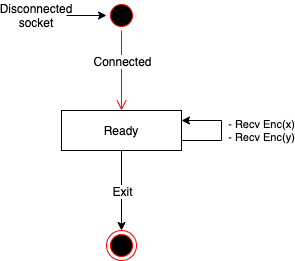

# Private Comparison

Private Comparision library (prv_cmp) compare the magnitudes of 1-bit integers x and y while encrypting them.


* Decryptor only obtains numerical comparison results without knowing x and y
* Encryptor1 encrypts the integer x (Enc(x)) and sends it to Evaluator
* Encryptor2 encrypts the integer x (Enc(y)) and sends it to Evaluator
* Evaluator performs a magnitude comparison operation on Enc (x) and Enc (y) in an encrypted state, and sends the result (Enc(x<=y {0,1})) to Decryptor

# Prerequisites
* Linux (Cent OS 7.3, Ubuntu LTS 16.04)
* gcc7 (g++ 7) or higher
* cmake 3.5
* PALISADE version 1.2
* doxygen (to generate documentation)
* xterm (to run demo app using `demo.sh`)

# How to build
1. Build and install [PALISADE](https://gitlab.com/palisade/palisade-release/tree/PALISADE-v1.2) and create symbolic link `~/palisade-release` from installed directory.
2. Run the following commands at the root of prv_cmp.
    ```sh
    $ git submodule update -i
    $ mkdir build && cd build
    $ cmake ..
    $ make
    ```
    
    the following files generated.

| File | Content |
|:---|:---|
| `build/prvc/prvc_dec/libprvc_dec.so` | Decryptor library |
| `build/prvc/prvc_enc/libprvc_enc.so` | Encryptor library |
| `build/prvc/prvc_eval/libprvc_eval.so` | Evaluator library |
| `build/stdsc/stdsc/libstdsc.so` | stdsc library |
| `demo/dec/dec` | Decryptor demo app |
| `demo/enc/enc` | Encryptor demo app |
| `demo/eval/eval` | Evaluator demo app |

# API Reference
1. Run the following command at the root directory to build the document.
    ```sh
    $ cd doc && doxygen
    ```
2. see `doc/html/index.html`

# How to run
* Run the following command at the root directory to run demo app.
    ```sh
    $ ./demo.sh
    ```
* Run the following command at the root directory to run test.
    ```sh
    $ cd test && ./test.sh
    ```

# Demo App
The demo app consists of four processes: Decryptor, Encryptor1, Encryptor2 and Evaluator. These processes communicate as shown in the following figure.


## Decryptor demo app
* Behavior
    * If the `-g` option is specified, Decryptor generates keys. (Fig: (1))
    * Decryptor receives the public key request, then returns a public key and context. (Fig: (2))
    * Decryptor receives the comparision results (Enc(x<y)), then decrypt it (-> x<y). (Fig: (6,7))
* Usage
    ```sh
    Usage: ./dec [-p pubkey_filename] [-s seckey_filename] [-c context_filename] \
                 [-e emk_filename] [-a eak_filename] [-t config_filename] [-g]
    ```
    * -p pubkey_filename : file path of public key file (OPTIONAL, Default:"pubkey.txt")
    * -s seckey_filename : file path of secret key file (OPTIONAL, Default:"seckey.txt")
    * -s context_filename : file path of context key file (OPTIONAL, Default:"context.txt")
    * -s emk_filename : file path of eval multi key file (OPTIONAL, Default:"emk.txt")
    * -s eak_filename : file path of eval automorphism key file (OPTIONAL, Default:"eak.txt")
    * -t config_filename : file path of configuration file (OPTINAL)
    * -g : generates FHE keys if this option is specified (OPTINAL)
* Configuration
    * Specify the following PALISADE parameters in the configuration file.
        ```
        mul_depth  = 4   (Default: 4)
        logN       = 13  (Default: 13)
        bit_len    = 30  (Default: 30)
        dcrt_bits  = 60  (Default: 60)
        rel_window = 0   (Default: 0)
        sigma      = 3.2 (Default: 3.2)
        ```

* State Transition Diagram
    * 

## Evaluator demo app
* Behavior
    * Evaluator sends the evk request to Decryptor, then receives the evk. (Fig: (2))
    * Evaluator receives the encrypted data (Enc(x), (y)) from Encryptor, then compute comparision and send results to Decryptor. (Fig: (4,5,6))
* Usage
    ```sh
    Usage: ./eval
    ```
    
* State Transition Diagram
  * 

## Encryptor demo app
* Behavior
    * Encryptor sends the public key request to Decryptor, then receives the public key. (Fig: (2))
    * Encryptor encrypts the input value, then sends encrypted data to Evaluator. (Fig: (3)(4))
* Usage
    ```sh
    Usage: ./client [-t is_neg] <value>
    ```
    * -t is_neg : boolean (0: false, 1: true) of mononical coefficient (OPTIONAL, Default:0)
    * <value>   : input value

# License
Copyright 2018 Yamana Laboratory, Waseda University
Supported by JST CREST Grant Number JPMJCR1503, Japan.

Licensed under the Apache License, Version 2.0 (the "License");
you may not use this file except in compliance with the License.
You may obtain a copy of the License at

http://www.apache.org/licenses/LICENSE-2.0

Unless required by applicable law or agreed to in writing, software
distributed under the License is distributed on an "AS IS" BASIS,
WITHOUT WARRANTIES OR CONDITIONS OF ANY KIND, either express or implied.
See the License for the specific language governing permissions and
limitations under the License.
